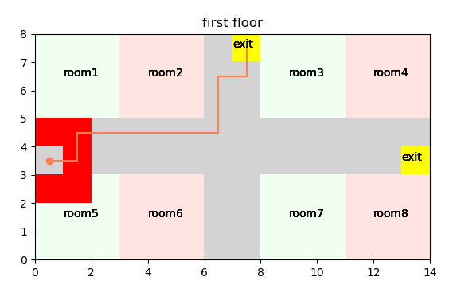

### Q-Learning 기반 재난환경에서 사용자의 최적 탈출 경로에 대한 연구

### :heavy_check_mark:핵심  

[**2020.02.06 한국통신학회 동계학술대회 학부 우수논문 부분 우수상**](https://www.dbpia.co.kr/journal/articleDetail?nodeId=NODE09346538)

[**2021.04 한국통신학회 논문지(KCI) 게재**](https://www.dbpia.co.kr/Journal/articleDetail?nodeId=NODE10547239)

기간 : 2019/09 - 2021/04    

*프로젝트의 경우에는 2020년 상반기까지 시뮬레이션 업데이트 작업이 있었고 이후로는 논문 작업*  

  

프로젝트 요약 : 재난 상황 중 대형 화재의 경우 화재 초기에 사망자 대부분이 발생하기 때문에 신속히 안전한 경로로 대피하는 것이 중요하다. 하지만 건물 내부에 머물던 사람의 경우 자신이 위치한 층 외의 다른 층까지 고려한 상황 판단을 할 수 없다는 문제가 있다. 따라서 다른 층의 상황을 고려한 최적의 탈출 경로를 제시하여 화재에 의한 피해를 줄일 수 있는 시스템이 필요하다. 이에 본 프로젝트는 건물에 화재가 발생한 상황을 고려하여 사용자의 현재 위치에서 최적의 탈출 경로를 찾기 위한 Q-Learning 기반 시스템 모델을 제시한다. 

역할 : 지도 교수님과 연구실 선배님들의 도움을 받아 완성된 단독 연구

* 이론으로 공부했던 내용을 처음으로 응용해본 프로젝트  

* 관련 연구를 찾고 시스템 모델을 설계하고 이를 구현해내어 비교 모델을 통해 성능을 평가하는 일련의 과정 경험  

* 프로젝트를 맞게 구현하고 있는지 확인하기 위한 디버깅을 어떻게 해야하는지 배울 수 있었다.  

* Q-Learning의 경우에는 학습을 하기 위한 시뮬레이션 환경의 크기의 중요성에 대해서 알 수 있었다.  

  * 시뮬레이션 환경이 큰 경우에는 학습에 오랜 시간이 소요된다.  
  * exploration한 탐색이 중요해진다.  

* 강화 학습의 Discount factor와 Learning rate 하이퍼 파라미터에 대해서 고찰해볼 수 있었다.  

  * **Discount factor**는 미래에 얻게 되는 보상으로부터 얼마나 영향을 받을 것인지에 대한 파라미터이다. 일반적으로 미래에 대한 신뢰도라고 표현하기도 한다. 일반적으로 강화학습에서 Discount factor의 영향을 받은 미래의 보상을 다음과 같이 표현한다.  

      

  * Discount factor의 경우 [0, 1]의 범위를 가지기 때문에 기본적으로 미래의 보상보다 현재의 보상에 같거나 높은 가중치를 두게 된다. Discount factor가 0에 가깝다는 것은 미래에 대한 보상값이 0에 가까워지기 때문에 거의 다음 상태의 보상만 고려한다는 뜻이 된다. 그리고 Discount factor가 1에 가깝다는 것은 미래의 모든 보상이 높은 중요도를 가진다는 뜻이다.  

  * **Learning rate**는 현재 경험을 통해 얻게 되는 보상으로부터 얼마나 영향을 받을 것인지에 대한 파라미터이다. 즉, 현재에 대한 신뢰도라고 표현할 수 있다. 일반적으로 Learning rate를 적용한 Q-Learning의 수식은 다음과 같다.  

    
  
  * Learning rate의 경우 (0, 1]의 범위를 가진다. Learning rate가 0에 가깝다는 것은 과거의 경험에 높은 가중치를 둔다는 뜻이고 1에 가깝다는 것은 현재의 경험에 높은 가중치를 둔다는 뜻이다.   
  
* 구현 능력에 대해서 반성하는 계기가 된 프로젝트이다. 처음으로 진행한 프로젝트다 보니 여유가 없었고 구현에만 급급했다. 결국 시뮬레이션에 고려해야하는 요소가 증가할수록 코드가 더러워졌고 어디 내놓기 부끄러운 코드가 되었다. 이후로는 매번 어떻게 해야 코드를 좀 정갈하게 구현할 수 있을까를 고민하면서 코드를 구현했다. 여유가 된다면 코드를 재탄생 시켜 보고 싶다.

  *이때부터 생겼던 깔끔한 코드 구현의 욕심은 궁극적으로 SSAFY 7기 입과 및 알고리즘 스터디장의 길로 인도했다..*

 

### :heavy_check_mark: 프로젝트 정리  

*논문에 작성된 내용 외 시뮬레이션 위주의 정리*  

### 요구사항  

* 알려진 것은 건물의 구조, 화재의 위치, 사용자의 위치, 사용자 주변의 사람의 수에 대한 정보뿐이다.  
  * 화재에 의해서 출구가 막힌다, 화재에 의해서 고립되었다, 사용자 주변에 사람이 많다 등 구체적은 상황은 제안한 Q-Learning 시스템이 자체적으로 판단하여 경로를 안내한다.  

* 화재가 발생한 곳을 피한다.  
* 하나의 층이 아니라 건물 전체 구조를 고려하여 최단 경로를 안내한다.  
* 사용자 주변에 사람이 많은 경우, 모두가 최단 경로로만 선택하면 병목 현상이 발생하여 탈출에 지연이 일어날 수 있다. 이를 고려하여 분산 경로를 제공할 수 있도록 한다.  
* 사용자가 화재에 고립되어 탈출 경로가 없는 경우를 판단한다.  
  * 이 시스템을 응용하면 사용자가 고립되어 구출이 우선적으로 필요하다는 알람을 보낼 수도 있다.  

 

### 시뮬레이션 환경  

  

* 시뮬레이션 환경은 위와 같이 2층으로 구성되어 있다. 시뮬레이션에서 회색은 사용자가 이동할 수 있는 복도, 노란색은 출구, 붉은색은 화재가 발생한 곳을 나타낸다.  

 

### 시뮬레이션 1  

  

* 시뮬레이션 1은 현재 위치에서 가장 가까운 출구가 화재에 의해서 막힌 경우 다른 출구를 선택하여 경로를 안내하는 것을 보여준다.  

 

### 시뮬레이션 2  

  

* 시뮬레이션 2는 현재 층(second floor)에서 가장 가까운 출구가 아니라 전체 경로를 고려해서 최단 경로로 갈 수 있는 출구로 사용자를 이동시키는 것을 보여준다.  

  

*  현재 층, 현재 위치에서 사용자에게 가장 가까운 출구는 아래쪽에 있는 출구이다. 하지만 사용자는 위에 있는 출구를 선택한다.  

  

* 이는 위에서 볼 수 있듯, 위쪽에 있는 출구로 내려갔을 때가 아래쪽에 있는 출구로 내려갔을 때보다 전체 경로상으로 최단 경로이기 때문이다.   

 

### 시뮬레이션 3  

  

* 시뮬레이션 3은 사용자의 위치 근처에 사람이 많은 경우 모든 사람이 최단 경로를 이용하여 출구로 이동하면 병목 현상이 일어나 탈출에 지연히 발생할 수 있다는 점을 고려하여 탈출 경로를 분산시키는 것을 보여준다.  
* 확률에 따라서 최단 경로와 차선 경로로 경로를 안내한다. 확률은 사용자 근처의 사람 수에 따라서 결정하여 사람이 적은 경우에는 최단 경로로 안내될 수 있도록하고 사람이 많은 경우에 분산 경로로 안내하도록 한다.  

 

### 시뮬레이션 4  

  

  

* 화재에 의해 고립된 경우 시스템 자체에서 화재에 의해 고립되었다는 사실을 판단할 수 있도록 Q-Learning 시스템을 구현하였다.  

  *화재에 의해 고립된 상황은 하드 코딩으로 체크한 것이 아니다. Q-Learning의 특성을 이용하여 판단했다.*  

 

### 시뮬레이션 5  

  

* 건물의 전체 상황을 고려하여 최적 경로를 결정하는 것을 보여준다.  

  

* second floor의 상황만 두고 봤을 때는 단순히 최단 경로로 이동하면 될 것 같다.  
  * 단순히 최단 경로로 이동하려면 위쪽 출구를 선택해야한다.  
* 하지만 아래쪽 출구를 선택한다.  
  * 아래쪽 출구는 최종 출구까지 두 번째로 짧은 경로로 안내했을 때 선택하게 되는 출구이다.  

  

* 이는 first floor의 상황이 위와 같기 때문이다. 단순히 최단 경로로 이동하게 되면 화재에 의해 고립되는 상황이 발생한다.  

* 이를 피하기 위해 두 번째로 짧은 경로를 선택하여 안내하도록 하였다.  

  *물론 이 상황도 하드 코딩은 없다. 시스템 상에서 판단한다.*  
